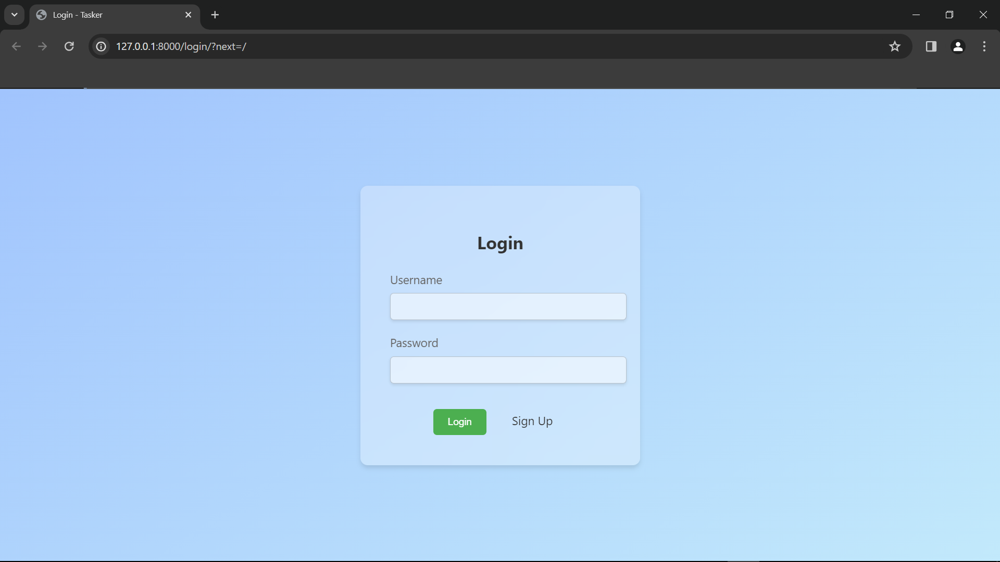
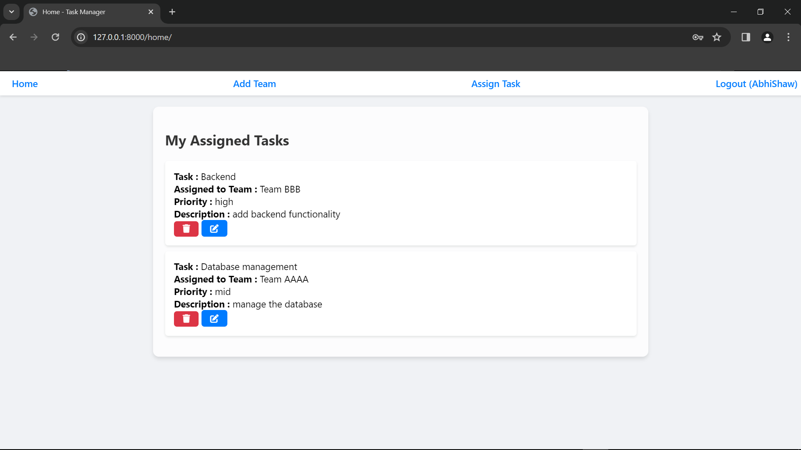
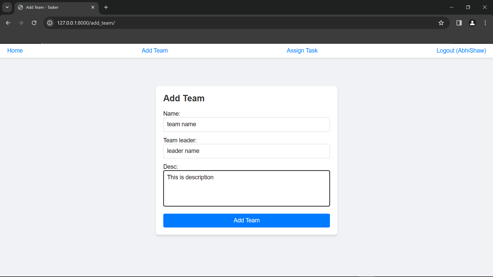
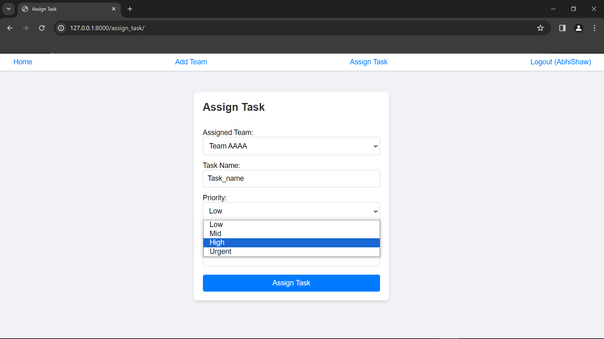

# Tasker App

Tasker is a Django-based web application designed to facilitate task management within teams. It allows users/managers to assign tasks to specific teams, set priorities, and manage the status of each task efficiently.

## Features

- **User Authentication**: Secure login and signup functionality for managing user access.
- **Task Assignment**: Users can assign tasks to teams, specifying the task details, priority, and deadline.
- **Task Management**: Users can edit or delete tasks as needed, ensuring flexible task management.
- **Team Creation**: Allows the creation of teams, specifying team names and members for targeted task assignments.

## Usage

After logging in, users can start creating teams and assigning tasks right away. Navigate through the app using the navbar links to access different functionalities.

## Contributing

Contributions to Tasker are welcome!

## Screenshots

